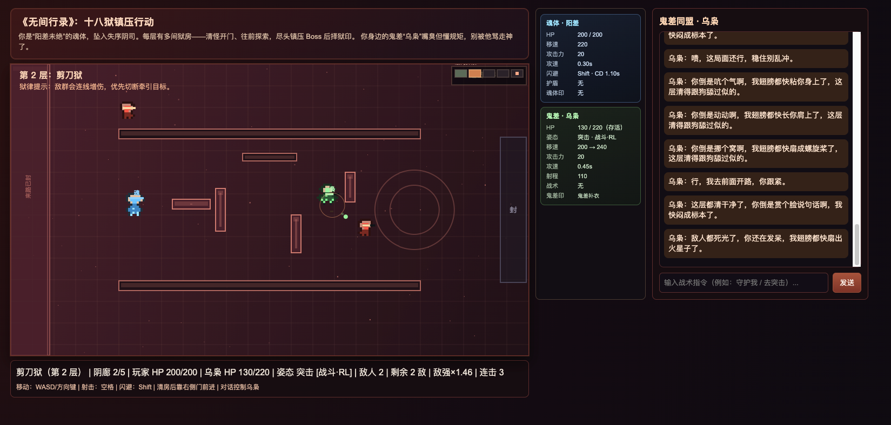

# AI Roguelite Web Demo

《无间行录》网页演示：2D 俯视角 Roguelite 战斗 + 可对话、可自主思考的鬼差同伴「乌枭」。

游戏前端（`game/`）与 NPC 后端（`server/`）完全分离：浏览器负责战斗与渲染，Python 服务负责 LLM 对话、战术指令解析和自主决策。



---

## 快速启动

### 环境要求

- Python 3.10+
- 可访问的 LLM API（默认配置为 DeepSeek 兼容接口）
- 现代浏览器（Chrome / Edge / Firefox 等）

### 1. 安装依赖

```bash
pip install -r requirements.txt
```

### 2. 配置

复制配置模板并填入你的 API Key：

```bash
cp config.example.yaml config.yaml
```

编辑 `config.yaml`，至少修改 `llm.api_key`。也可用环境变量覆盖（优先级更高）：

```bash
export AI_NPC_LLM_API_KEY="sk-xxxx"
export AI_NPC_LLM_BASE_URL="https://api.deepseek.com"
export AI_NPC_LLM_MODEL="deepseek-chat"
```

配置解析顺序（后者覆盖前者）：

1. `server/npc_backend/config.py` 默认值
2. 项目根目录 `config.yaml`
3. 环境变量 `AI_NPC_LLM_API_KEY` / `AI_NPC_LLM_BASE_URL` / `AI_NPC_LLM_MODEL`

**嵌入模型说明：** 默认使用 `BAAI/bge-small-zh-v1.5`，缓存目录为 `models/`。若 `embeddings.local_files_only: true`（默认），需事先把模型放到 `models/`，否则启动会失败。首次使用可改为 `local_files_only: false`，让 HuggingFace 自动下载。

### 3. 导入世界观与角色设定（首次运行）

```bash
python scripts/import_world_setting.py
python scripts/import_persona_setting.py --npc-id wuxiao_01
```

- 世界观 / 角色设定为覆盖导入，可重复执行
- 运行中产生的对话记忆由游戏自动追加，不会被脚本清空
- NPC ID 请使用 **`wuxiao_01`**（与前端硬编码一致）

### 4. 启动服务（需要两个终端）

**终端 1 — NPC API：**

```bash
python run.py
```

监听 `http://127.0.0.1:5100`，提供对话、战术指令和自主思考接口。

**终端 2 — 游戏页面：**

```bash
python run_game.py
```

默认监听 `http://127.0.0.1:8082`（端口可通过参数修改，如 `python run_game.py 8080`）。

### 5. 打开游戏

浏览器访问：

```
http://127.0.0.1:8082
```

若对话或乌枭自主发言无响应，先确认 NPC API 已启动，并访问 `http://127.0.0.1:5100/health` 应返回 `{"status":"ok"}`。

---

## 玩法介绍

### 背景

你是坠入阴司的魂体，在多层「狱」中向前探索。身边的鬼差**乌枭**嘴臭但靠谱——战斗里他会跟着你打，聊天框里可以用自然语言指挥他，他也会根据战况自己开口。

### 操作

| 操作 | 按键 |
|------|------|
| 移动 | WASD / 方向键 |
| 射击 | 空格 |
| 闪避 | Shift |
| 与乌枭对话 | 右侧聊天框输入后发送 |

### 关卡流程

1. **探索狱房**：每层的房间由走廊、战斗房、精英房、Boss 房等组成，清完当前房敌人后门会打开。
2. **靠门前进**：清房后移动到右侧门边进入下一间。
3. **镇压 Boss**：每层尽头击败 Boss。
4. **选择狱印**：Boss 后从三张「狱印」中选一张强化本局，然后进入下一层。

狱印分三类，可重复叠层（有上限）：

- **魂体印**：强化玩家（移速、伤害、闪避、生命等）
- **鬼差印**：强化乌枭（守护减伤、回血、集火等）
- **契约印**：强化配合效果

### 战斗要点

- 场景中有柱子、断墙等掩体，可利用障碍物阻挡视线和弹幕。
- 敌人类型包括小怪、精英、Boss；部分 Boss 会释放范围技能（如地面圈、荆棘墙等）。
- 玩家与乌枭都有独立血量；乌枭倒下后会暂时失联，本层仍由玩家继续推进。

### 乌枭战斗姿态

通过聊天下达战术指令，无需额外按钮。当前实现两种姿态：

| 姿态 | 行为概要 |
|------|----------|
| **守护（guard）** | 默认姿态。乌枭用寻路回到你身边并跟随，攻击射程内敌人；贴近时为你减伤。玩家危急时他会主动救援（回血 + 护盾）。 |
| **突击（assault）** | 乌枭前压到敌人附近交战，自动绕障接近；进入战斗距离后由策略模型控制走位与输出（浏览器加载 `game/resources/limbs/assault_skirmish/policy.onnx`；失败则降级规则 AI）。 |

指令示例：

- 「回来守护我」「贴着我」→ 守护
- 「上去打」「突击」→ 突击
- 其他内容 → 正常对话

HUD 会显示当前姿态；突击时还会标注当前是策略模型还是规则 AI 在控制。

---

## 智能 NPC 设计

乌枭不只是一个聊天机器人。后端把**玩家主动对话**和**战斗中的自主行为**分成两条链路，共用记忆与角色设定，但决策节奏不同。

### 整体架构

```text
浏览器（game/）
  ├─ 战斗循环：上报 scene_info（血量、敌数、姿态、弹幕威胁等）
  ├─ POST /api/chat/stream   ← 玩家发消息
  └─ POST /api/npc/think     ← 定时/事件触发，乌枭自主思考

NPC API（server/）
  ├─ 意图分类：对话 vs 战术指令（guard / assault）
  ├─ 记忆检索：世界观、人设、历史对话
  ├─ 流式生成：对话 token + 情绪标签
  └─ 自主决策：noop / 切姿态 / 主动说一句话
```

### 玩家对话（`/api/chat/stream`）

玩家输入后，服务端**并行**执行意图分类和记忆检索：

- 识别为**战术指令** → 直接返回 `command` 事件，前端切换乌枭姿态并显示确认语
- 识别为**对话** → 拼装 Prompt 后流式输出回复，末尾附带情绪标签（如 `focused`、`worried`）

对话会写入短期记忆；结束后异步分级（日常 / 重要）并写入 ChromaDB 长期记忆，供后续检索。

### 自主思考（`/api/npc/think`）

战斗中前端持续上报局面，后端按优先级触发乌枭「想一想」：

| 优先级 | 典型场景 | 处理方式 |
|--------|----------|----------|
| P0 危急 | 乌枭/玩家濒死、玩家发呆挨打 | 规则优先：求援、切守护等硬响应 |
| P1 场景 | 换层、Boss 出现、敌群突变 | 规则给**提示**，由 LLM 生成自然台词 |
| P2 战术 | 弹幕、缄言、地面圈、视线被挡 | 战术提示 + LLM 决策 |
| P3 日常 | 长时间无对话、局面平稳 | LLM 决定是否碎嘴；无话可说则保持沉默 |

决策结果三类：

- `noop`：不说话、不动
- `command`：切换 guard / assault
- `dialogue`：主动说一句话（气泡 + 可选记录）

为避免话痨，系统带有发言冷却、去重、战术意图有效期（如 30s 内不反复反转姿态）等约束。守护贴身时还会过滤「跟紧我」等与姿态矛盾的台词。

### 记忆系统

| 类型 | 存储 | 用途 |
|------|------|------|
| 短期记忆 | 进程内 deque | 最近若干轮对话，重启服务后清空 |
| 世界观 | ChromaDB | `lore/world_setting.md` 导入 |
| 角色设定 | ChromaDB | `lore/persona_setting.md` 导入 |
| 对话记忆 | ChromaDB | 运行时追加，分 daily 摘要 / important 原文 |

检索时一次 embedding，并行查询多类记忆，拼进 Prompt 上下文。

### 情绪与表达

对话回复末尾由模型输出 `<emotion>...</emotion>`，前端映射为颜文字气泡。自主发言的战术确认句也会走气泡展示，保持战斗中的存在感。

### 角色：乌枭（`wuxiao_01`）

设定见 `lore/persona_setting.md`：嘴臭、话痨、重规矩的鬼差，熟悉阴司狱房结构。他会根据当前楼层、敌情、你的血量、自己的姿态和最近说过的话来调整语气，而不是每句都念固定模板。

---

## 项目结构（简）

```text
├─ run.py / run_game.py      # 启动入口
├─ config.example.yaml       # 配置模板
├─ game/                     # 游戏客户端（静态页面 + JS）
├─ server/                   # NPC API（Flask）
├─ lore/                     # 世界观与角色文本
├─ scripts/                  # ChromaDB 导入脚本
└─ data/ / models/           # 运行时数据（gitignore，需本地生成或下载）
```
